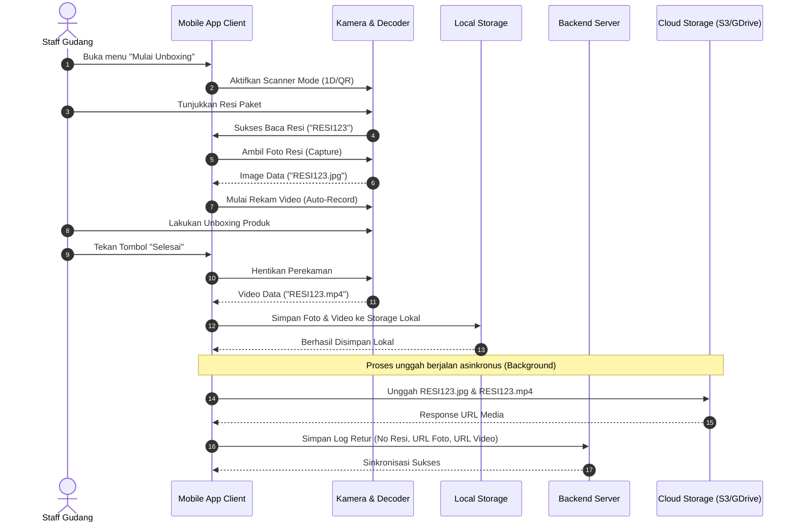
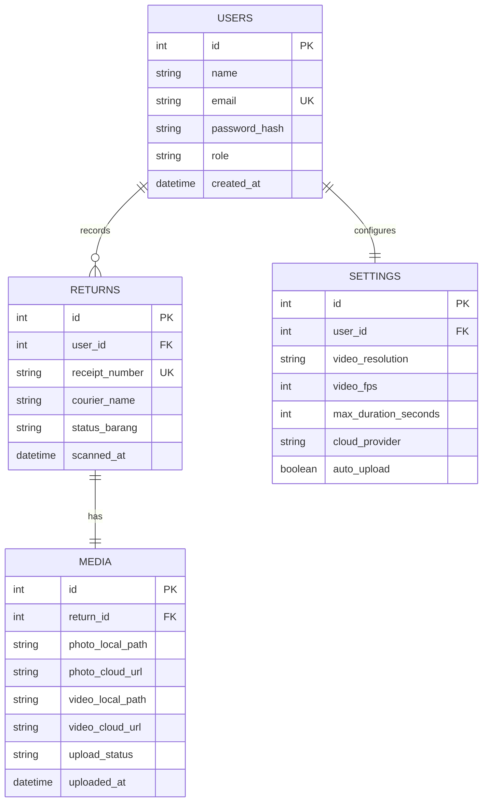

# PRD — Project Requirements Document

## 1. Overview
Aplikasi ini dirancang untuk mempermudah seller e-commerce dalam mendokumentasikan proses unboxing barang retur (kembali) dari pembeli. Masalah utama yang sering dihadapi seller adalah hilangnya bukti valid saat mengajukan banding atas klaim retur yang curang (fraud). Proses manual—mulai dari memfoto resi, merekam video unboxing, memindahkan file, hingga mengganti nama file agar sesuai dengan nomor resi—memakan waktu yang sangat lama dan rentan terhadap kesalahan manusia (human error).

**Visi Produk:**
Menjadi alat bantu operasional gudang yang super cepat, andal, dan otomatis dalam merekam bukti fisik retur berbasis nomor resi paket secara *real-time*.

**Target Pengguna (User Personas):**
*   **Staff Gudang / Admin Retur:** Orang yang bertugas menerima paket, membuka paket, dan memeriksa kondisi fisik produk retur. Membutuhkan proses yang cepat, hands-free, dan tidak membingungkan.
*   **Pemilik Toko (Owner/Manager):** Orang yang membutuhkan dokumentasi yang rapi dan terorganisir untuk melakukan banding klaim di marketplace.

---

## 2. Requirements

### Functional Requirements
*   **F-01:** Sistem harus dapat memindai barcode 1D dan QR Code pada resi pengiriman menggunakan kamera perangkat secara instan.
*   **F-02:** Sistem harus mengambil foto resi paket secara otomatis setelah barcode/QR Code berhasil teridentifikasi.
*   **F-03:** Sistem harus langsung memulai perekaman video unboxing secara otomatis tanpa jeda setelah foto resi diambil.
*   **F-04:** Sistem harus menamai file foto dan video secara otomatis menggunakan format nomor resi yang berhasil dipindai (contoh: `RESI_12345678.jpg` dan `RESI_12345678.mp4`).
*   **F-05:** Pengguna harus dapat mengatur preferensi video (resolusi, frame rate (FPS), batas durasi maksimal perekaman, dan pilihan penyimpanan).
*   **F-06:** Sistem harus mendukung mode penyimpanan lokal (on-device) maupun sinkronisasi otomatis ke penyimpanan awan (cloud storage).

### Non-Functional Requirements
*   **Performance:** Proses deteksi barcode/QR Code harus memiliki latensi kurang dari 500 ms dalam kondisi pencahayaan standar gudang.
*   **Security:** Semua transfer data video ke cloud storage harus menggunakan protokol terenkripsi (HTTPS/SSL) dan memiliki mekanisme autentikasi yang aman.
*   **Reliability (Offline-first):** Aplikasi harus tetap berfungsi secara penuh saat koneksi internet terputus. Video dan foto disimpan di penyimpanan lokal terlebih dahulu, lalu diunggah saat koneksi internet kembali stabil.
*   **Scalability:** Struktur penyimpanan file di cloud harus diorganisasi per tanggal dan bulan agar memudahkan pencarian aset video berukuran besar.

---

## 3. Core Features

| ID Fitur | Nama Fitur | Deskripsi | Prioritas | Estimasi Kompleksitas |
| :--- | :--- | :--- | :--- | :--- |
| **FEAT-01** | Smart Scanner (1D/QR) | Scanner kamera cepat yang otomatis mendeteksi barcode 1D (resi kurir) dan QR Code. | High | Medium |
| **FEAT-02** | Auto-Capture & Record | Mekanisme transisi instan dari scan resi -> ambil foto resi -> mulai rekam video. | High | High |
| **FEAT-03** | Auto-Naming Engine | Penamaan otomatis aset file multimedia berdasarkan ekstraksi nomor resi. | High | Low |
| **FEAT-04** | Video Configurator | Halaman pengaturan untuk mengatur kualitas video (720p/1080p), FPS (30/60 FPS), dan batas waktu rekam. | Medium | Low |
| **FEAT-05** | Storage Manager & Sync | Fitur untuk melihat sisa penyimpanan lokal dan status upload file ke Cloud (Google Drive / AWS S3). | Medium | High |

---

## 4. User Flow

1.  **Persiapan:** Staff gudang membuka aplikasi di perangkat smartphone/tablet yang terpasang pada stand/holder meja unboxing.
2.  **Pemindaian (Scanning):** Staff mengarahkan resi paket retur ke arah kamera scanner.
3.  **Proses Otomatis:**
    *   Kamera berhasil membaca kode resi (misal: `NLX1928374`).
    *   Aplikasi berbunyi *beep*, mengambil foto kualitas tinggi dari resi tersebut, dan menyimpannya sebagai `NLX1928374_resi.jpg`.
    *   Aplikasi langsung menampilkan visual perekaman video dan timer mulai berjalan (otomatis merekam).
4.  **Proses Unboxing:** Staff menggunakan kedua tangannya untuk membuka paket retur dan menunjukkan kondisi produk di depan kamera.
5.  **Selesai:** Staff menekan tombol "Selesai" (atau perekaman berhenti otomatis saat batas durasi maksimal yang diatur di setting tercapai).
6.  **Penyimpanan:** Video otomatis disimpan dengan nama `NLX1928374_unboxing.mp4`. Aplikasi kembali ke mode siaga (siap scan paket berikutnya). File diunggah ke cloud di latar belakang (background sync).

---

## 5. Architecture
Aplikasi ini menggunakan arsitektur **Client-Server** dengan pendekatan *Offline-First*.

*   **Client Side (Mobile/Tablet App):** Bertanggung jawab atas pemrosesan gambar secara lokal untuk pembacaan barcode, manajemen hardware kamera untuk foto/video, serta penyimpanan lokal sementara (SQLite & Local Storage).
*   **Server Side (Backend API):** Bertanggung jawab atas otorisasi perangkat, pencatatan log transaksi retur, dan koordinasi pengiriman data ke media penyimpanan cloud.
*   **Cloud Storage Object:** Tempat penyimpanan utama untuk file video dan foto berukuran besar agar tidak membebani memori internal perangkat klien secara terus-menerus.

---

## 6. Sequence Diagram

---

## 7. Database Schema

Rancangan database relasional ini dibuat untuk melacak riwayat unboxing paket retur, konfigurasi dari tiap perangkat, dan metadata dari file yang berhasil disimpan.

### Entity Relationship Diagram (ERD)

---

## 8. Tech Stack

### Frontend (Mobile Application)
*   **Framework:** Flutter (Dart) atau React Native. Pilihan utama jatuh pada Flutter karena performa rendering kamera yang tinggi dan konsisten di Android maupun iOS.
*   **Barcode Library:** Google ML Kit Barcode Scanning (sangat cepat dan akurat dalam membaca barcode rusak/kotor).
*   **Camera API:** Camera plugin dengan konfigurasi kustom untuk *seamless switching* dari mode foto ke mode video.
*   **Local Database:** SQLite (melalui Sqflite) untuk menyimpan status antrean upload.

### Backend (Server API)
*   **Runtime Environment:** Node.js (TypeScript) dengan NestJS Framework untuk skalabilitas dan struktur kode yang bersih.
*   **Database Utama:** PostgreSQL untuk mengelola metadata relasional data user, log retur, dan status upload.

### Storage & Hosting
*   **Cloud Storage:** AWS S3 atau Google Cloud Storage (menggunakan fitur *Multipart Upload* untuk video berukuran besar).
*   **Hosting Server:** Docker Container yang dijalankan di AWS ECS atau DigitalOcean App Platform.

### Third-Party Integrations
*   **Google Drive API:** Integrasi opsional bagi pengguna skala kecil (UMKM) yang ingin menyimpan video langsung ke Google Drive pribadi mereka.